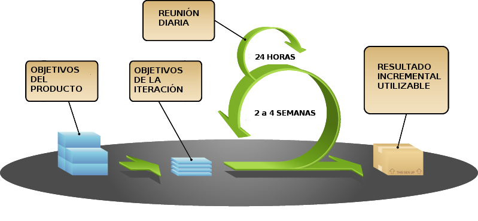

# **Apunts_UF1_1**

## **ELEMENTS DEL DESENVOLUPAMENT DE SOFTWARE**

### **Tipús de software**

* **De sistema:** Es el tipus de software que s’utilitza per els sistemes operatius (Ubuntu, Windows, etc...).
* **De aplicación:** Es el tipus de software que s’utilitza per les aplicacions que tens al teu sistema operatiu (Google Chrome, Discord, Gimp,etc...).
* **De desenvolupament:** Es el tipus de software que s’utilitza per els editors (Microsoft Word, LibreOffice Writer, etc...).
----------------------

### **Relació hardware-software**

* **Disc dur:** Emmagatzema de forma permanent els arxius executables i els arxius de dades.
* **Memòria RAM:** Emmagatzema de forma temporal el codi binari dels arxius executables i els arxius de dades necessàries.
* **CPU:** Llegeix i executa instruccions emmagatzemades en memòria RAM, així com les dades necessàries.
* **Perifèrics d'entrada / sortida:** Recull noves dades des de l'entrada i es mostren els resultats.

```sh
El "Disc dur" emmagatzema de forma permanent els archius executables i els archius 
de dades mentre que la "Memoria RAM" emmagatzema de forma temporal els archius executables, 
després la "CPU" les llegeix i les executa.
```
----------------------

### **Tipús de codi**

* **Codi font:** Es el archiu de text lellible en llenguatge de programació.
* **Codi objecte:** Es el archiu binari que no es pot executar, diguem que es el intermig entre els dos perque transforma el codi alfanumeric a codi binari perque es pugui executar.
* **Codi executable:** Es el archiu binari que finalment es por executar.
----------------------

### **Fases principals de Desenvolupament de software**

***ANÀLISI:*** Es determina i defineix clarament les necessitats del client i s'especifica els requisits que ha de complir el programari a desenvolupar.

- L'especificació de requisits ha de:
    - Ser completa i sense omissions.
    - Ser concisa i sense trivialitats.
    - evitar ambigüitats.
    - Evitar detalls de disseny o implementació.
    - Ser comprensible pel client.
    - Separar requisits funcionals i no funcionals.
    - Dividir i jerarquitzar el model.
    - Fixar criteris de validació.

***DISSENY:*** Es descompon i organitza el sistema en elements que poden ser desenvolupats per separat.

- Les activitats habituals són les següents:
    - Disseny arquitectònic.
    - Disseny detallat.
    - Disseny de dades.
    - Disseny d'interfície.

***CODIFICACIÓ:*** S'escriu el codi font de cada component.

- Es poden utilitzar diferents llenguatges informàtics:
    - Llenguatges de programació : C, C ++, Java, Javascript, ...
    - Llenguatges d'un altre tipus : HTML, XML, ...

***PROVES:*** El objectiu de les proves ha de ser aconseguir que el programa funcioni incorrectament i que es descobreixin defectes, haurem que sotmetre a el programa a el màxim nombre de situacions diferents.

***MANTENIMENT:*** Durant l'explotació de sistema programari és necessari realitzar canvis ocasionals, per a això cal refer part de la feina feta en les fases prèvies.

- Tipus de manteniment:
    - Correctiu : Es corregeixen defectes.
    - Perfectiu : Es millora la funcionalitat.
    - Evolutiu : S'afegeix funcionalitats noves.
    - Adaptatiu : S'adapta a nous entorns.
----------------------

### **Resultats després de cada fase**
* **Enginyeria de sistemes:** Especificació de sistema.
* **ANÀLISI:** Especificació de requisits de programari.
* **DISSENY arquitectònic:** Document d'arquitectura de programari.
* **DISSENY detallat:** Especificació de mòduls i funcions.
* **CODIFICACIÓ:** Codi font.
* **PROVES d'unitats:** Mòduls utilitzables.
* **PROVES d'integració:** Sistema utilitzable.
* **PROVES de sistema:** Sistema acceptat.
* **Documentació:** Documentació tècnica i d'usuari.
* **MANTENIMENT:** Informes d'errors i control de canvis.
----------------------

### **MODELS DE DESENVOLUPAMENT DE PROGRAMARI**

#### **Models clàssics (predictius)**
* **Model en cascada:**
    * Model de major antiguitat.
    * Identifica les fases principals de desenvolupament programari.
    * Les fases s'han de fer en l'ordre indicat.
    * El resultat d'una fase és l'entrada de la següent fase.
    * És un model bastant rígid que no s'adapta molt be a canvis continus.


* **Model en V:**
    * Model molt semblant a el model en cascada.
    * Visió jerarquitzada amb diferents nivells.
    * Els nivells superiors indiquen major abstracció (coses més generals).
    * Els nivells inferiors indiquen major nivell de detall (coses més exactes).
    * El resultat d'una fase és l'entrada de la següent fase.


#### **Model de construcció de prototips**
* Els requisits no estan especificats clarament:
    * Per no tenir experiència prèvia.
    * Per falta de concreció del client.


* Procés:
    * Durant la **fase d'anàlisi** es crea un prototip perque el client pugui probar-lo per refinar els requisits de programari a desenvolupar segons el client.
    * Es repeteix el pas anterior les vegades necessàries fins que el client estigui satisfet amb el prototip per començar amb el model final.

* Tipus de prototips:
    * **Prototips ràpids:** El prototip pot estar desenvolupat usant un altre llenguatge i / o eines i finalment el prototip es rebutja.
    * **Prototips evolutius:** El prototip està dissenyat en el mateix llenguatge i eines de el projecte i el prototip es fa servir com a base per desenvolupar el projecte.

#### **Models evolutius o incrementals**
* **Model en espiral (iteratius):** Va ser desenvolupada per Boehm en el 1988. Es una comunicació continua amb el client (es fan totes les fases amb el client).


* **Metodologies àgils (adaptatius):**
    * Són mètodes d'enginyeria de programari basats en el desenvolupament iteratiu i incremental.
    * Els requisits i solucions evolucionen amb el temps segons la necessitat de el projecte.
    * El treball és realitzat mitjançant la col·laboració d'equips auto-organitzats i multidisciplinaris (Que engloba diverses disciplines.), immersos en un procés compartit de presa de decisions.

    **Desenvolupament Àgil:**
    * **Individus i interaccions** sobre processos i eines.
    * **Programari funcionant** sobre documentació extensiva.
    * **Col·laboració amb el client** sobre negociació contractual.
    * **Resposta davant el canvi** sobre seguir un pla.

Les metodologies àgils més conegudes són:
* **Kanban:**
    * També es denomina "**sistema de targetes**".
    * Va ser desenvolupat inicialment per **Toyota** per a la indústria de fabricació de productes .
    
    

* **Scrum:**
    * Model de desenvolupament incremental.
    * Iteracions (**sprint**) **regulars** cada 2, 3 o 4 setmanes.
    * A el principi de cada iteració s'estableixen els seus **objectius prioritzats** (**sprint backlog**).
    * Hi reunions diàries per tractar la marxa de l'***esprint***.
    
    

    * **Rols principals:**
        * **Product Owner:** És "la veu de el client". Defineix criteris d'acceptació i assegura que es compleixin.
        * **Scrum Màster:** Assegura que se segueix la metodologia Scrum. Motiva i facilita el treball de l'equip.
        * **Team:** Equip de desenvolupament auto-organitzat i multifuncional. Entre 6 i 10 membres.
    * **Artefactes:**
        * **Product backlog:** Llista ordenada amb els requisits del producte
        * **Sprint backlog:** Llista de requisits trets de l'backlog per al seu desenvolupament durant l'esprint
        * **Increment:** Estat del producte després de cada esprint
    * **Esdeveniments:**
        * **Sprint:** Esdeveniment principal, que conté a la resta d'esdeveniments. Duracción màxima: 1 mes.
        * **Sprint Planning:** Reunió inicial on es planifica el treball de l'Sprint. Durada màxima: 8 hores.
        * **Daily Scrum:** Reunió diària de posada en comú sobre la marxa de l'esprint. Durada màxima: 15 minuts.
        * **Scrum Review:** Reunió final per avaluar l'increment obtingut. Durada màxima: 4 hores.
        * **Scrum Retrospective:** Reunió final per avaluar la correcta aplicació de la metodologia Scrum. Durada màxima: 3 hores.
        
* **XP (PROGRAMACIÓ EXTREMA):**
    * Disseny senzill.
    * Petites millores contínues.
    * Proves i refactorització.
    * Integració contínua.
    * **Programació per parelles**.
    * **El client s'integra en l'equip de desenvolupament**.
    * Propietat de el codi compartida.
    * Estàndards de codificació.
    * 40 hores setmanals.
----------------------

## **LLENGUATGES DE PROGRAMACIÓ**

### **Obtenció de codi executable**

Per obtenir codi binari executable tenim 2 opcions:
* **Llenguatge compilat:** És un llenguatge de programació que tradueix un programa escrit en llenguatge de programació un altre llenguatge de programació això fa que la execució sigui molt eficient, generant un programa d'equivalent que la màquina sigui capaç d'interpretar.
    * Exemples: C, C++.
    * Principal avantatge: Execució molt eficient.
    * Principal desavantatge: Cal compilar cada vegada que el codi font és modificat.

* **Llenguatge interpretat:** És un llenguatge de programació que està dissenyat per ser executat per un intèrpret ja que el codi font s’interpreta directament, en contrast amb els llenguatges compilats.
    * Exemples: PHP, Javascript.
    * Principal avantatge: El codi font s'interpreta directament.
    * Principal desavantatge: Execució menys eficient.

### **Procés de Compilació / Interpretació**

* La compilació / interpretació de el codi font es porta a terme en dues fases:
    * Anàlisi lèxic
    * Anàlisi sintàctica
* Si no hi ha errors, es genera el codi objecte corresponent.
* Un codi font correctament escrit no vol dir que funcioni segons el desitjat.
* No es realitza una anàlisi semàntic.

### **Tipus**

#### ***Segons la forma en què operen:***

* **Llenguatge imperatiu:** El llenguatge imperatiu indica els passos a seguir per obtenir un resultat.
	- Estructurats: C.
	- Orientats a objectes: Java.
	- Multiparadigma: C ++, Javascript.
    - **Molts d'aquests llenguatges són compilats.**
    
* **Llenguatge declaratiu:** El llenguatge declaratiu indica el resultat sense especificar els passos que a seguit.
	- Lògics: Utilitzen regles. Exemple: Prolog.
	- Funcionals: Utilitzen funcions. Exemple: Lisp, Haskell.
	- Algebraics: Utilitzen sentències. Exemple: SQL.
    - **Normalment són llenguatges interpretats.**

#### ***Tipus de llenguatges segons nivell d'abstracció:***

* **Baix nivell:** Assemblador.
* **Medi nivell:** C.
* **Alt nivell:** C++, Java.
----------------------

## **CRITERIS PER A LA SELECCIÓ D'UN LLENGUATGE**

- Camp d'aplicació.
- Experiència prèvia.
- Eines de desenvolupament.
- Documentació disponible.
- Base d'usuaris.
- Reusabilitat.
- Portabilitat.
- Imposició de el client.
(El que sigui més fàcil i còmode per a tu.)
